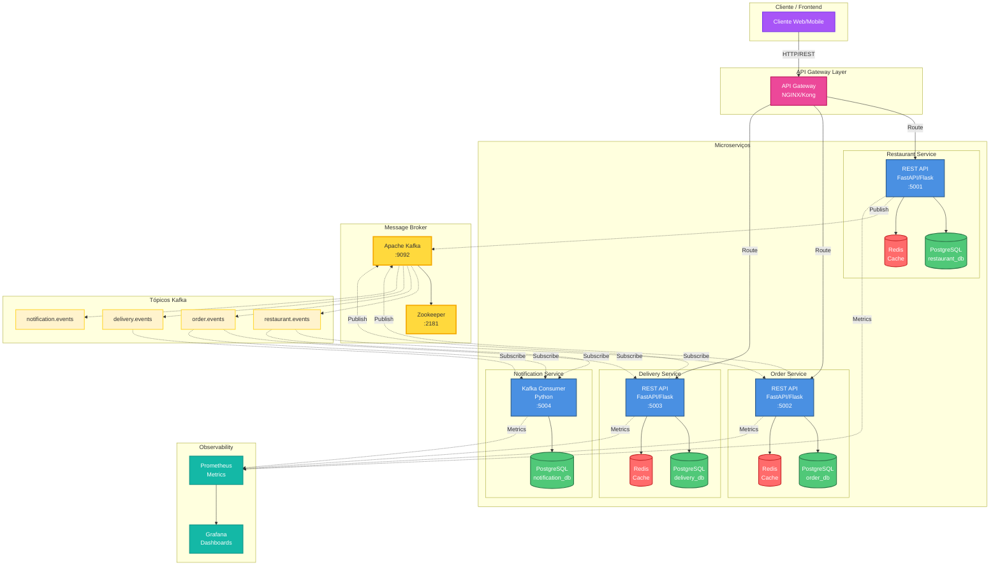

```mermaid
graph TB
    subgraph "Cliente / Frontend"
        CLIENT[Cliente Web/Mobile]
    end

    subgraph "API Gateway Layer"
        GATEWAY[API Gateway<br/>NGINX/Kong]
    end

    subgraph "Microserviços"
        subgraph "Restaurant Service"
            REST_API[REST API<br/>FastAPI/Flask<br/>:5001]
            REST_DB[(PostgreSQL<br/>restaurant_db)]
            REST_CACHE[(Redis<br/>Cache)]
            REST_API --> REST_DB
            REST_API --> REST_CACHE
        end

        subgraph "Order Service"
            ORDER_API[REST API<br/>FastAPI/Flask<br/>:5002]
            ORDER_DB[(PostgreSQL<br/>order_db)]
            ORDER_CACHE[(Redis<br/>Cache)]
            ORDER_API --> ORDER_DB
            ORDER_API --> ORDER_CACHE
        end

        subgraph "Delivery Service"
            DELIV_API[REST API<br/>FastAPI/Flask<br/>:5003]
            DELIV_DB[(PostgreSQL<br/>delivery_db)]
            DELIV_CACHE[(Redis<br/>Cache)]
            DELIV_API --> DELIV_DB
            DELIV_API --> DELIV_CACHE
        end

        subgraph "Notification Service"
            NOTIF_SVC[Kafka Consumer<br/>Python<br/>:5004]
            NOTIF_DB[(PostgreSQL<br/>notification_db)]
            NOTIF_SVC --> NOTIF_DB
        end
    end

    subgraph "Message Broker"
        KAFKA[Apache Kafka<br/>:9092]
        ZOOKEEPER[Zookeeper<br/>:2181]
        KAFKA --> ZOOKEEPER
    end

    subgraph "Observability"
        PROMETHEUS[Prometheus<br/>Metrics]
        GRAFANA[Grafana<br/>Dashboards]
        PROMETHEUS --> GRAFANA
    end

    subgraph "Tópicos Kafka"
        TOPIC_REST[restaurant.events]
        TOPIC_ORDER[order.events]
        TOPIC_DELIV[delivery.events]
        TOPIC_NOTIF[notification.events]
    end

    %% Fluxo Cliente
    CLIENT -->|HTTP/REST| GATEWAY
    GATEWAY -->|Route| REST_API
    GATEWAY -->|Route| ORDER_API
    GATEWAY -->|Route| DELIV_API

    %% Eventos Kafka - Restaurant Service
    REST_API -.->|Publish| KAFKA
    KAFKA -.-> TOPIC_REST

    %% Eventos Kafka - Order Service
    ORDER_API -.->|Publish| KAFKA
    KAFKA -.-> TOPIC_ORDER
    TOPIC_REST -.->|Subscribe| ORDER_API

    %% Eventos Kafka - Delivery Service
    DELIV_API -.->|Publish| KAFKA
    KAFKA -.-> TOPIC_DELIV
    TOPIC_ORDER -.->|Subscribe| DELIV_API

    %% Eventos Kafka - Notification Service
    KAFKA -.-> TOPIC_NOTIF
    TOPIC_ORDER -.->|Subscribe| NOTIF_SVC
    TOPIC_DELIV -.->|Subscribe| NOTIF_SVC
    TOPIC_REST -.->|Subscribe| NOTIF_SVC

    %% Observability
    REST_API -.->|Metrics| PROMETHEUS
    ORDER_API -.->|Metrics| PROMETHEUS
    DELIV_API -.->|Metrics| PROMETHEUS
    NOTIF_SVC -.->|Metrics| PROMETHEUS

    %% Estilos
    classDef serviceStyle fill:#4A90E2,stroke:#2E5C8A,stroke-width:2px,color:#fff
    classDef dbStyle fill:#50C878,stroke:#2D7A4A,stroke-width:2px,color:#fff
    classDef cacheStyle fill:#FF6B6B,stroke:#C92A2A,stroke-width:2px,color:#fff
    classDef kafkaStyle fill:#FFD93D,stroke:#F4A900,stroke-width:3px,color:#333
    classDef topicStyle fill:#FFF3CD,stroke:#FFD93D,stroke-width:2px,color:#333
    classDef clientStyle fill:#A855F7,stroke:#7C3AED,stroke-width:2px,color:#fff
    classDef gatewayStyle fill:#EC4899,stroke:#BE185D,stroke-width:2px,color:#fff
    classDef observeStyle fill:#14B8A6,stroke:#0D9488,stroke-width:2px,color:#fff

    class REST_API,ORDER_API,DELIV_API,NOTIF_SVC serviceStyle
    class REST_DB,ORDER_DB,DELIV_DB,NOTIF_DB dbStyle
    class REST_CACHE,ORDER_CACHE,DELIV_CACHE cacheStyle
    class KAFKA,ZOOKEEPER kafkaStyle
    class TOPIC_REST,TOPIC_ORDER,TOPIC_DELIV,TOPIC_NOTIF topicStyle
    class CLIENT clientStyle
    class GATEWAY gatewayStyle
    class PROMETHEUS,GRAFANA observeStyle
```