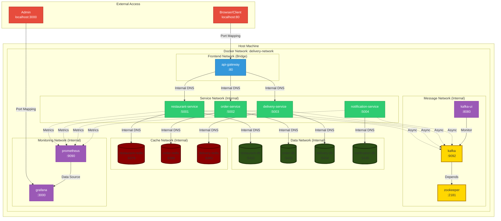

```mermaid
graph TB
    subgraph "Host Machine"
        subgraph "Docker Network: delivery-network"
            subgraph "Frontend Network (Bridge)"
                GATEWAY[api-gateway<br/>:80]
            end
            
            subgraph "Service Network (Internal)"
                REST[restaurant-service<br/>:5001]
                ORDER[order-service<br/>:5002]
                DELIV[delivery-service<br/>:5003]
                NOTIF[notification-service<br/>:5004]
            end
            
            subgraph "Data Network (Internal)"
                REST_DB[(restaurant-db<br/>:5432)]
                ORDER_DB[(order-db<br/>:5433)]
                DELIV_DB[(delivery-db<br/>:5434)]
                NOTIF_DB[(notification-db<br/>:5435)]
            end
            
            subgraph "Cache Network (Internal)"
                REST_REDIS[(restaurant-redis<br/>:6379)]
                ORDER_REDIS[(order-redis<br/>:6380)]
                DELIV_REDIS[(delivery-redis<br/>:6381)]
            end
            
            subgraph "Message Network (Internal)"
                ZOOKEEPER[zookeeper<br/>:2181]
                KAFKA[kafka<br/>:9092]
                KAFKA_UI[kafka-ui<br/>:8080]
            end
            
            subgraph "Monitoring Network (Internal)"
                PROM[prometheus<br/>:9090]
                GRAF[grafana<br/>:3000]
            end
        end
    end

    subgraph "External Access"
        BROWSER[Browser/Client<br/>localhost:80]
        ADMIN[Admin<br/>localhost:3000]
    end

    %% External to Gateway
    BROWSER -->|Port Mapping| GATEWAY
    ADMIN -->|Port Mapping| GRAF

    %% Gateway to Services
    GATEWAY -->|Internal DNS| REST
    GATEWAY -->|Internal DNS| ORDER
    GATEWAY -->|Internal DNS| DELIV

    %% Services to Databases
    REST -->|Internal DNS| REST_DB
    ORDER -->|Internal DNS| ORDER_DB
    DELIV -->|Internal DNS| DELIV_DB
    NOTIF -->|Internal DNS| NOTIF_DB

    %% Services to Cache
    REST -->|Internal DNS| REST_REDIS
    ORDER -->|Internal DNS| ORDER_REDIS
    DELIV -->|Internal DNS| DELIV_REDIS

    %% Services to Kafka
    REST -.->|Async| KAFKA
    ORDER -.->|Async| KAFKA
    DELIV -.->|Async| KAFKA
    NOTIF -.->|Async| KAFKA
    KAFKA -->|Depends| ZOOKEEPER
    KAFKA_UI -->|Monitor| KAFKA

    %% Monitoring
    REST -.->|Metrics| PROM
    ORDER -.->|Metrics| PROM
    DELIV -.->|Metrics| PROM
    NOTIF -.->|Metrics| PROM
    PROM -->|Data Source| GRAF

    %% Network Security Rules
    style REST_DB fill:#2D5016,stroke:#1A2F0A,stroke-width:3px
    style ORDER_DB fill:#2D5016,stroke:#1A2F0A,stroke-width:3px
    style DELIV_DB fill:#2D5016,stroke:#1A2F0A,stroke-width:3px
    style NOTIF_DB fill:#2D5016,stroke:#1A2F0A,stroke-width:3px
    
    style REST_REDIS fill:#8B0000,stroke:#5A0000,stroke-width:3px
    style ORDER_REDIS fill:#8B0000,stroke:#5A0000,stroke-width:3px
    style DELIV_REDIS fill:#8B0000,stroke:#5A0000,stroke-width:3px
    
    style KAFKA fill:#FFD700,stroke:#B8860B,stroke-width:3px
    style ZOOKEEPER fill:#FFD700,stroke:#B8860B,stroke-width:3px

    classDef external fill:#E74C3C,stroke:#C0392B,stroke-width:2px,color:#fff
    classDef gateway fill:#3498DB,stroke:#2980B9,stroke-width:2px,color:#fff
    classDef service fill:#2ECC71,stroke:#27AE60,stroke-width:2px,color:#fff
    classDef monitor fill:#9B59B6,stroke:#8E44AD,stroke-width:2px,color:#fff
    
    class BROWSER,ADMIN external
    class GATEWAY gateway
    class REST,ORDER,DELIV,NOTIF service
    class PROM,GRAF,KAFKA_UI monitor
```