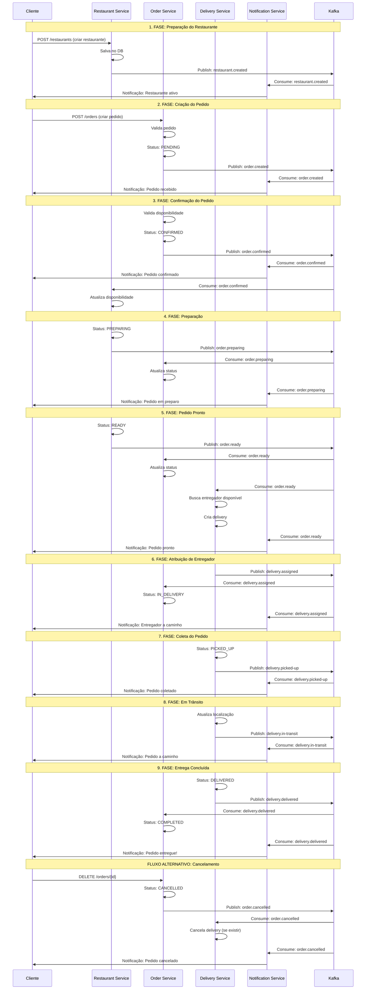

```mermaid
sequenceDiagram
    participant C as Cliente
    participant R as Restaurant Service
    participant O as Order Service
    participant D as Delivery Service
    participant N as Notification Service
    participant K as Kafka

    Note over C,K: 1. FASE: Preparação do Restaurante
    C->>R: POST /restaurants (criar restaurante)
    R->>R: Salva no DB
    R->>K: Publish: restaurant.created
    K->>N: Consume: restaurant.created
    N->>C: Notificação: Restaurante ativo

    Note over C,K: 2. FASE: Criação do Pedido
    C->>O: POST /orders (criar pedido)
    O->>O: Valida pedido
    O->>O: Status: PENDING
    O->>K: Publish: order.created
    K->>N: Consume: order.created
    N->>C: Notificação: Pedido recebido

    Note over C,K: 3. FASE: Confirmação do Pedido
    O->>O: Valida disponibilidade
    O->>O: Status: CONFIRMED
    O->>K: Publish: order.confirmed
    K->>N: Consume: order.confirmed
    N->>C: Notificação: Pedido confirmado
    K->>R: Consume: order.confirmed
    R->>R: Atualiza disponibilidade

    Note over C,K: 4. FASE: Preparação
    R->>R: Status: PREPARING
    R->>K: Publish: order.preparing
    K->>O: Consume: order.preparing
    O->>O: Atualiza status
    K->>N: Consume: order.preparing
    N->>C: Notificação: Pedido em preparo

    Note over C,K: 5. FASE: Pedido Pronto
    R->>R: Status: READY
    R->>K: Publish: order.ready
    K->>O: Consume: order.ready
    O->>O: Atualiza status
    K->>D: Consume: order.ready
    D->>D: Busca entregador disponível
    D->>D: Cria delivery
    K->>N: Consume: order.ready
    N->>C: Notificação: Pedido pronto

    Note over C,K: 6. FASE: Atribuição de Entregador
    D->>K: Publish: delivery.assigned
    K->>O: Consume: delivery.assigned
    O->>O: Status: IN_DELIVERY
    K->>N: Consume: delivery.assigned
    N->>C: Notificação: Entregador a caminho

    Note over C,K: 7. FASE: Coleta do Pedido
    D->>D: Status: PICKED_UP
    D->>K: Publish: delivery.picked-up
    K->>N: Consume: delivery.picked-up
    N->>C: Notificação: Pedido coletado

    Note over C,K: 8. FASE: Em Trânsito
    D->>D: Atualiza localização
    D->>K: Publish: delivery.in-transit
    K->>N: Consume: delivery.in-transit
    N->>C: Notificação: Pedido a caminho

    Note over C,K: 9. FASE: Entrega Concluída
    D->>D: Status: DELIVERED
    D->>K: Publish: delivery.delivered
    K->>O: Consume: delivery.delivered
    O->>O: Status: COMPLETED
    K->>N: Consume: delivery.delivered
    N->>C: Notificação: Pedido entregue!

    Note over C,K: FLUXO ALTERNATIVO: Cancelamento
    C->>O: DELETE /orders/{id}
    O->>O: Status: CANCELLED
    O->>K: Publish: order.cancelled
    K->>D: Consume: order.cancelled
    D->>D: Cancela delivery (se existir)
    K->>N: Consume: order.cancelled
    N->>C: Notificação: Pedido cancelado
```